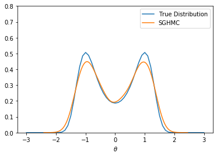
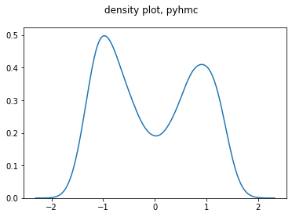
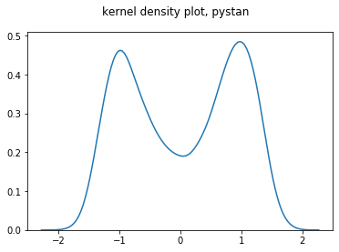
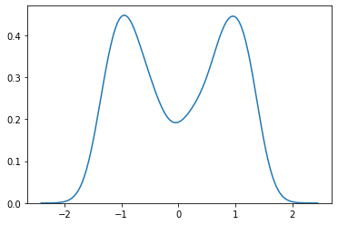
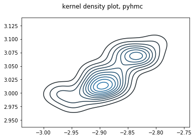
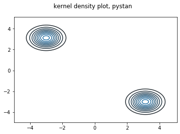

# STA663 Final Project: Stochstic Gradient Hamiltonian Monte Carlo in Python

Xiangwen Mo, Bingruo Wu

## 1. Abstract

Stochastic Gradient Hamiltononian Monte Carlo is implemented in this project, and the algorithm is learned from the paper $\textit{Stochastic Gradient Hamiltonian Monte Carlo}$ by Chen et al (2014). We applied this algorithm to simulate dataset and real dateset and compare its time complexity and efficiency to other Hamiltonian Monte Carlo methods, for example, method used by Pyhmc package and Pystan package. We also used 'numba' to optimize our SGHMC algorithm. The comparison among package 'Pyhmc','Pystan'and SGHMC indicated that user specified input was crucial for developing a high efficienct and accuract performance if SGHMC is used.

key words: hamiltonian monte carlo, stochastic gradient, minibatch, Pystan, Pyhmc

## 2. Introduction and Background

Hamiltonian Monte Carlo(HMC) sampling methods define a target function by learning from the transformation between potential and kinetic energy and parameterize them by introducing 'momentum' auxiliary variables. Under Hammiltonian dynamics, the target distribution is invariant and the use of Metropolis-Hastings samplings achieves high acceptance rate. However, one limitation of HMC is its computational complexity increasing with data size due to the necessity of computing potential energy gradient for each simulaiton. Therefore, in order to make HMC algorithm more applicable to large dataset problem, Chen.T, Fox.E and Guestrin.C, introduced Stochastic Gradient Hamiltonian Monte Carlo(SGHMC) sampling method in 2014.

SGHMC maintains the stationarity of the target distribution as HMC, also improves time complexity and can be used widely in pratical applications if Markov Chain Monte Carlo is applicable. One advantages of SGHMC is its high efficiency in handling large dataset. However, one of the limitations of SGHMC is its demand for the accuracy of users specified inputs, and another limitation is if the original dataset is not large enough, the use of minibatch may instead increase implementation complexity.

## 3. Algorithm

#### Hamiltonian Monte Carlo (HMC)

In order to sample from the posterior distribution $p(\theta|D)$, HMC introduces a set of auxiliary momentum variables $\textit{r}$ to establish a new joint distribution $(\theta, r)$:
$$
\pi(\theta,r)\propto \exp(-U(\theta)-\frac{1}{2}r^TM^{-1}r)\ \ \  (1)
$$
where $\textit{U}$ is a potential energy function,
$$
U = \sum_{x\in D}log p(x|D)-log p(\theta)\ \ \ (2)
$$
and $\theta$ can be sampled from the marginal distribution $p(\theta|D)$.

Learning from a physical definition, Hamiltonian function: $H(\theta,r)= U(\theta)+\frac{1}{2}r^TM^{-1}r$,can be seen as the measurement of the total energy of a physical system and the dynamic equations are the following:
$$
d\theta = M^{-1}r dt \ \ (3)
$$
$$
dr = - \nabla U(\theta) dt \ \  (4)
$$

#### Stochastic Gradient HMC (SGHMC)

The improvement made by stochastic gradient HMC is instead of computing $\nabla U$ using equation (4) in the whole dataset, SGHMC computes a $\tilde U$ on a minibacth $\tilde D$ uniformly sampled from the entire dataset D:

$$
\nabla \tilde U(\theta)=-\frac{|D|}{|\tilde D|}\sum_{x\in \tilde{D}}\nabla logp(x|\theta)-\nabla logp(\theta), \tilde{D} \in D \ \ \ (5)
$$

which can be approximated by:

$$
\nabla \tilde U(\theta) \simeq \nabla U(\theta)+N(0,V(\theta))\ \ \ (6)
$$

Therefore, replace $\nabla U(\theta)$ in (4) by $\nabla \tilde U(\theta)$ in (6) and the dynamic equations become:

$$
d \theta = M^{-1}rdt\ \ \ (7)
$$

$$
dr = -\nabla U(\theta) + N(0,2B(\theta)dt)\ \ \ (8)
$$

where $B(\theta)=\frac{1}{2}\epsilon V(\theta)$, and $\epsilon$ is a step term introduced from Metroplis-Hasting sampling, since above dynamic equations are considered as discretized systems in practice, so MH steps must be implemented. 

Nonetheless, $\pi(\theta,r)$ is not invariant under the new dynamics of equations (7) and (8), because of $B(\theta)$ being a positive semi-definite matrix contributed by gradient noise, a $\textit{Friction}$ term is suggested to be added by Chen et al.(2014). This modification takes the edge of the noises caused by stochastic gradient and make the target distribution $\pi(\theta,r)$ invariant again. Therefore, the dynamic equations become the following:

$$
d \theta = M^{-1}rdt\ \ \ \ (9)
$$

$$
dr = -\nabla U(\theta) dt - BM^{-1}rdt+N(0,2B(\theta)dt) \ \ \ \ (10)
$$

#### Stochastic Gradient HMC (SGHMC) in Practice

As mentioned above, B is the noise matrix and is estimated as $\hat{B}$ in practice with a user specified friction term $C$, where $C \geq \hat{B}$. Therefore, the dynamic equations become:

$$
d \theta = M^{-1}rdt\ \ \ (11)
$$

$$
dr = -\nabla U(\theta) dt - CM^{-1}rdt+N(0,2(C-\hat{B})dt)+N(0,2B(\theta)dt) \ \ \ \ (12)
$$

The true stochastic gradient noise matrix B is not zero as $B=\frac{1}{2}\epsilon V$, but if the step size $\epsilon$ tends to zero, B becomes zero and the user specified $C$ dominants.

Therefore, this algorithm becomes:

Take the initial values of $\theta_0, r_0, \epsilon, M, \hat{B}, B, C$
then update through: 

$$
\theta_i=\theta_{i-1}+\epsilon_tM^{-1}r_{i-1} \ \ \ (13)
$$

$$
r_i=r_{i-1}-\epsilon_t \nabla \tilde {U}(\theta_i)-\epsilon_t CM^{-1}r_{i-1}+N(0,2(C-\hat{B})\epsilon_t) \ \ \ (14)
$$

When i = 0,1,2,...

## 4. Optimization for Performance

To implement SGHMC, we must have a function to compute gradients of log densities for interested problems. Users should write their own gradient function in python first, and pass it into the sghmc function. Sghmc function takes user-specified gradient functions, initial guess, data and other parameters as the algorithm specified.   

As our algorithm is a inherently sequential MCMC process, it can't be parallelized. Each parameter's full conditional distribution depends on other parameters, so it is natural to implement loops. The main calculation is gradients and product of matrices.  

Things we did for optimization includes (see `Optimization.ipynb` for details and timing):  
- Apply Cholesky decomposition based multivariate normal sampling: pre-calculate Cholesky decomposed covariance matrices needed for sampling in the loop.  
- JIT compilation of our SGHMC algorithm (data batching code with/without JIT compilation)  

We compared performances for a simple multinormal model, $x_i \sim \mathcal{N}(\theta_i, 1)$, with prior $\theta_i \sim \mathcal{N}(0,1)$. We passed 10000 observations with p =10 and p=100 respectively. The perforances are shown below: 

|  	| original 	| efficiency improve 	| numba (main algorithm) 	| numba (main and data-batch) 	|
|:---------------------:	|:----------------:	|:------------------:	|:----------------------:	|:---------------------------:	|
| Normal model, p=10 	| 1.22 s ± 21.5 ms 	| 440 ms ± 13.1 ms 	| 457 ms ± 16.2 	| 462 ms ± 15.2 ms 	|
| Normal model, p = 100 	| 8.57 s ± 260 ms 	| 2.27 s ± 124 ms 	| 2.16 s ± 71.4 ms 	| 2.45 s ± 85.3 ms 	|

From the above table we notice that there is a relative big improvement when we apply Cholesky decompositioin method. When we have larger number of parameters, JIT-compilation of only the main algorithm performs a little bit better. For these reasons, we believe that our efficiency improved version is sufficient enough.   

We also compared performances of four versions of our alogrithm for the mixture normal model, with $p(x \mid \mu_1, \mu_2) = 0.5\mathcal{N}(\mu_1, 1) + 0.5 \mathcal{N}(\mu_2, 1)$, true $\mu = (-3, 3)$, with 200 observations. Parameters are chosen the same as <b>Application to Simulated Dataset and Comparison</b> section below. The performaces are shown below: 

| algorithm 	| Performance 	|
|:---------------------------:	|:----------------:	|
| original 	| 4.5 s ± 51.1 ms 	|
| efficiency improve 	| 4.28 s ± 46.6 ms 	|
| numba (main algorithm) 	| 4.34 s ± 66.2 ms 	|
| numba (main and data-batch) 	| 4.34 s ± 52.8 ms 	|

We obtain the similar result from the mixture normal example, that JIT compilation do a little in improving algorithm performances. Also, profiling shows that augto-gradient calculation done by jacobian function (from autograd package) takes expensive computation times. Therefore we recommend users to define the gradient function by themselves.

## 5. Aplications to Simulated Data Set and Comparison

In this part, SGHMC is applied to simulated data sets, the same as the original paper and results are displayed here. In addition, simulations are also implemented by Python package Pystan and Pyhmc, which are used as the comparison with SHMMC.

### Example 1: True Distribution vs SGHMC

The true target distirbution is $U(\theta)=-2\theta^2+\theta^4$, and modefied to $\nabla{\tilde{U(\theta)}}=\nabla{U(\theta})+N(0,4)$ in the SGHMC algorithm. $\epsilon=0.1$ is chosen for every step and other parameters are chosen as the following table:

| C | V | Batch Size | Epochs| Burns |
| --- | --- | --- | --- | --- |
| 4 | 4 | 1 | 4000| 200 |

We firstly compared the true distribution and SGHMC in the following figure and we can see that data simulated by SGHMC is over all close to the original distribution, except a small underestimation at the local maximum points.

{width=450px}

### Example 1: Pyhmc vs Pystan vs SGHMC

Next, we compared the simulation results from package 'Pystan' and ’Pyhmc‘ to SGHMC to see the difference between their accuracy and efficiency. Last graph shows the simulation obtained from SGHMC and we can find that 'Pystan' has a better simulation result compared to 'Pyhmc', since it looks more similar to the SGHMC graph and closer to the true distribution as well.

 
{width=200px}
{width=200px}
{width=200px}  

### Example 2: Mix Normal by SGHMC

The smapling distribution is a mix normal and defined as $X \sim \frac{1}{2}N(\mu_1,1)+\frac{1}{2}N(\mu_2,1)$, where true $\mu = (-3,3)$. We choose C, $\hat{V}$, and M as identity matrix, learning rate $\epsilon = 0.01$. This example will use SGHMC to simulate this distribution with the prior of $\mu_1$ and $\mu_2$ being $N(0,10)$.

{width=380px}  

### Example 2: Mix Normal by Pystan and Pyhmc

After showing the result from SGHMC, this part will show our results from using Pystan and Pyhmc and do the comparison as well. 

{width=290px}{width=270px}

Overall, compared to the graph from Pyhmc in example 2, Pystan performs better since it looks more similar to a mix normal distribution. Pystan performs poor in both examples and also not as good as SGHMC in example 1. However, in example 2, results from pystan looks better than SGHMC, that is because the use of Pystan is quiet easy since it only needs distribution and data set to do the simulation, while SGHMC needs user specified elements, such as C and V. Therefore, if user specified elements are inaccurate, the resutls might be wrong. But if users can approximate accurate and precise input, SGHMC can contribute better results than Pystan and Pyhmc.

## 6. Application to Real Datasets

The algorithm is highly sensitive to the choice of hyper-parameters. We use the 'Wine' data from \textbf{https://archive.ics.uci.edu/ml/index.php} and attempted to fit a linear regression to the dataset to apply the algorithm. This dataset has 178 observations and we firstly used two variables: 'Flavanoids' and 'Phenols' to fit a graph as below:

{width=300px}!

This graph seems to be a linear regression, so we thought using SGHMC can estimate the coefficients. However, when we used this algorithm to do the estimation, we ended up getting 'NAN'. We tried to use various combinations of parameters and tried different inputs to implement the algorithm, all of the results are not reasonable enough.This failure indicates a limitation of the SGHMC algorithm, which is users should choose reasonable and accurate initial inputs to ensure the performance of SGHMC.

## 7. Discussion/Conclusion

Through implementation and testing process we find that SGHMC is an efficient sampler as testig with simulated datasets. Optimizing algorithm produce quick results. However, the algorithm requires multiple senstive hyper-parameters such as $V(\theta)$ , learning rate $\epsilon$, noise term added to stochastic minibatch sampling process, etc. The sampler's accuracy is highly depends on these values. If we set these parameters differently, we will obtain different distributions.   

We notice that HMC algorithm in STAN package is efficient and stable without need for hyper-parameters setting. As the paper mentions, applying adaptive improvement in HMC techniques to SGHMC algorithm will increase efficiencies of the algorithm on more practical real-world application with larger datasets.

## Reference

[1] Chen, Fox, Guestrin. Stochastic Gradient Hamiltonian Monte Carlo. ICML 2014  
[2] Neal, R.M. MCMC using Hamiltonian dynamics. Handbook of Markov Chain Monte Carlo 2010  

## Code

Github repository for package and write-up is on https://github.com/xiangwenmo/SGHMC-final-project. Installation instruction is in the README.md file.

